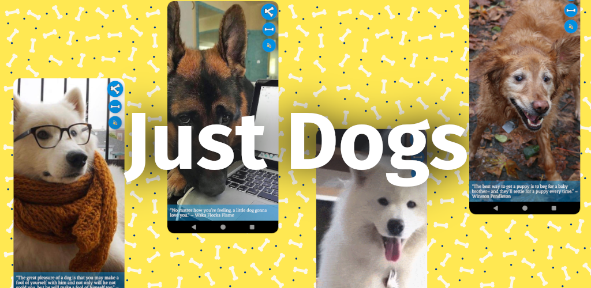

# Just Dogs | An Infinite Scroll of Infinite Dogs
Spend some time with man's best friend in this React Native application

The Just Dogs app idea came from me spending too much time on Reddit on my phone, and wanting a different infinite scroll option that would only have "nice things".
The app is written with React Native, and the API is hosted through Firebase (previously on a VPS LEMN stack).

## Monetization 🪙
A goal with this app was to implement full monetization, through delivering ads and offering in-app purchases. The app serves ads via AppLovin (though my account is currently on hold, so no ads at the moment) and offers an IAP to remove adds for $1.00. 
The app does not require you to sign in, which offers an interesting challenge for IAP, as users need the ability to restore purchases on new devices.

## API 🔥
The API has 3 endpoints, and 2 Firestore collections. Its purpose is to facilitate the restoration of users purchases. When a user makes a purchase, they are prompted to enter their email. After doing so, a request is made to store their email and their IAP token. Then if a user needs to restore a purchase (ie gets a new device, reinstalls the app, etc), they enter their email and receive a restoration code sent via the Mailgun API. The user can then enter the code, which is verified by the server, and if successful their purchase is restored.

## Frontend 🐕️
The frontend of this app contains 2 screens, one of which is not visible to the end user. Upon launch the app displays a loading screen which matches the splash screen. During this time it verifies any previous purchases, and appropriately assigns advertising. Then it reveals the infinite scroll screen.
The InfiniteScroll initially obtains 4 images from the DogCEO API, then each time the user scrolls, it loads another. This ensures the user always has a buffer of dogs to scroll to.
This page also sports a data delete button for users who have purchased premium. This allows users to remove their email from the server, but it also removes their ability to restore a purchase in the future. This is done to be in compliance with Google Play TOS.

Download this app and spend some time with mans best friend 🐕